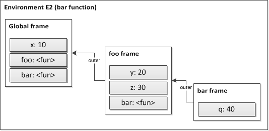
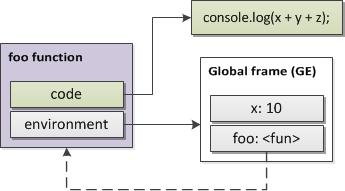
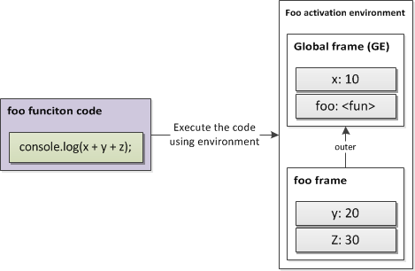

## 导言

### 自由变量(Free variable)
另一个和一等函数相关的重要概念就是自由变量.  

* 一个变量被函数使用，但是这个变量既不是这个函数的参数也不是本地变量那么这个变量就是自由变量.

换句话说，自由边界就是不是放在自己环境的变量，它有可能是被一些环境包裹起.注意,一个自由变量可能已经绑定(ie:如发生在父级环境)或者没绑定.第二种情况在ECMAScript会触发一个ReferenceError(引用错误).

如下例：

```
// Global environment (GE)
 
var x = 10;
 
function foo(y) {
 
  // environment of "foo" function (E1)
 
  var z = 30;
 
  function bar(q) {
    // environment of "bar" function (E2)
    return x + y + z + q;
  }
 
  // return "bar" to the outside
  return bar;
 
}
 
var bar = foo(20);
 
bar(40); // 100
```

在这个例子中我们有三个环境：GE，E1和E2分布对应着全局对象，foo函数和bar函数.

因此对于bar函数，变量x,y和z都是自由变量--它们对于bar既不是正规参数也不是本地变量.

注意，foo函数没有使用自由变量.但是，变量x被用在bar函数内，同时bar函数在foo函数执行时创建，因此foo函数应该保存其父级环境绑定，这样的话就可以将x的信息传递给更深结构的函数(在这里就是bar函数).

在其bar函数执行后期待且正确的结果为100，这表明bar函数不知怎么的在foo函数结束后记住了foo函数的环境(这里也是bar函数创建的地方). 再次强调这不同于c语言基于栈的活动记录模型.  

显然，如果我们想要嵌套很多函数的结构拥有静态(词法)作用域，同时也要第一级别函数，我们必须在函数创建时保存所有已使用的自由变量。


### 环境定义(Environment definition)
 
 最简单直接实现这样的算法是保存函数创建时所有的父级环境，在其之后执行(这里的情况是bar的执行)我们再用本地变量和参数创建自己的环境，并配置我们已保存的外部环境用来查询那里的自由变量.  

 术语"环境"既可以形容单对象绑定，也可以用于一系列嵌套依赖的对象绑定.在之后的例子中我们也许将对象绑定称作环境帧.在这个视角中：

 * 一个环境是一个序列帧，每一帧保存一个记录(可能是空记录)，它以键值对的形式存在。

注意，因为这是一般定义，所以我们使用抽象概念记录它并由指定确切的实现结构，也许是用哈希表也可能是栈内存，甚至是虚拟机上的寄存器，等等。  

如下例，环境E2有三个帧：自己的bar，以及foo和golobal.环境E1包含两个帧：自己的foo和global.全局环境GE只有自己global帧.


一个帧对于任何变量只能有一个绑定，每个帧也都有一个指向外围环境的指针，global帧的这个指针指向null，一个变量的值由离当前环境最近绑定的值决定，如果在这些序列帧没有绑定这个变量，那么就可以说这个变量在这个环境没有绑定(这时会引起一个ReferenceError错误)  

```
var x = 10;
 
(function foo(y) {
   
  // use of free-bound "x" variable
  console.log(x);
 
  // own-bound "y" variable
  console.log(y); // 20
   
  // and free-unbound variable "z"
  console.log(z); // ReferenceError: "z" is not defined
 
})(20);
```

I.e. 往回说作用域的概念，序列环境帧(或者说环境链)构成了我所说的作用域链，并不意外，ES3有一个准确的术语--- a scope chain  

注意： 一个环境也许可以为多个内部环境充当外围环境  

```
// Global environment (GE)
 
var x = 10;
 
function foo() {
 
  // "foo" environment (E1)
 
  var x = 20;
  var y = 30;
 
  console.log(x + y);
 
}
 
function bar() {
   
  // "bar" environment (E2)
 
  var z = 40;
 
  console.log(x + z);
}
```

因此先前的代码解释如下：  

```
// global
GE = {
  x: 10,
  outer: null
};
 
// foo
E1 = {
  x: 20,
  y: 30,
  outer: GE
};
 
// bar
E2 = {
  z: 40,
  outer: GE
};
```

下一章图展示他们之间的关系:


这个关系中，x在其当前环境的绑定覆盖了E1同名x的绑定


### 函数的创建和调用规则(Rules of function creation and application)

这一节中我们将解释函数创建和调用的一般性规则:

* 一个在给定环境创建的函数，最终结果是一个包含函数体和指向函数创建时所在环境的函数对象. 

```
// global "x"
var x = 10;
 
// function "foo" is created relatively
// to the global environment
 
function foo(y) {
  var z = 30;
  console.log(x + y + z);
}
```

对应的伪代码:
```
// create "foo" function
 
foo = functionObject {
  code: "console.log(x + y + z);"
  environment: {x: 10, outer: null}
};
```

这个函数对象如下图所示：
  

注意，函数引用其环境，且这个环境的一个函数绑定指回了这个函数对象.  

* 当一个函数传入一些列参数调用，这时一个新的帧形成绑定其实参和本地变量，然后执行其函数体，一个新的环境构造完成.新的帧关联到函数创建时包围的环境.  

函数调用:  

```
// function "foo" is applied
// to the argument 20
 
foo(20);
```

对应其伪代码：  

```
// create a new frame with formal 
// parameters and local variables
 
fooFrame = {
  y: 20,
  z: 30,
  outer: foo.environment
};
 
// and evaluate the code
// of the "foo" function 
 
execute(foo.code, fooFrame); // 60
```  

下图展示了函数调用时使用的环境:  


从结论的第一点中我们直接找到了闭包的定义

### 闭包(closure)

* 闭包是函数代码和函数创建时环境的结合对. 

如先前所提到的，闭包是为了解决"将函数作为参数问题".这样就可以让我们更好的理解.  
### 函数作为参数问题(funarg provblem)

函数作为参数问题可以拆分为两个子问题，它们都和作用域，环境，闭包的概念相关.  

* 将函数作为参数问题提升到对应的返回内部函数到外面 --i.e 返回函数如何使用父级环境的自由变量?  

```
(function (x) {
  return function (y) {
    return x + y;
  };
})(10)(20); // 30
```

我们已经知道词法作用域将外围帧保存在堆(heap)上--这就是答案.将绑定存储在栈(stack：用于c)上将不再适合.让我们再次重复，保存的代码块和环境就是闭包.  

* 函数作为参数问题下至传入函数参数如何对函数自由变量的求值问题.是在其定义时还执行时?  

```
var x = 10;
 
(function (funArg) {
 
  var x = 20;
  funArg(); // 10, not 20
 
})(function () { // create and pass a funarg
  console.log(x);
});
```

i.e 这个问题涉及到静态(词法)还是动态作用域的问题.这里我们已经知道答案，静态(词法)作用域就是答案.我们存储词法变量来避免这样的误会.再次强调已存的词法变量和函数代码就是我们所谓的闭包.  

所以最后我们的结论是? 第一级别函数,闭包，和词法环境的概念是非常紧密相关的，并且词法环境准确的来说是我们为了实现闭包和静态作用域的技术.  

在这一步中提到的ECMAScript使用的具体环境栈模型，我们将在以后的章节讨论.    

闭包具体细节解释可以在 [chapter 6. Cloures](http://dmitrysoshnikov.com/ecmascript/chapter-6-closures/) 中看到


