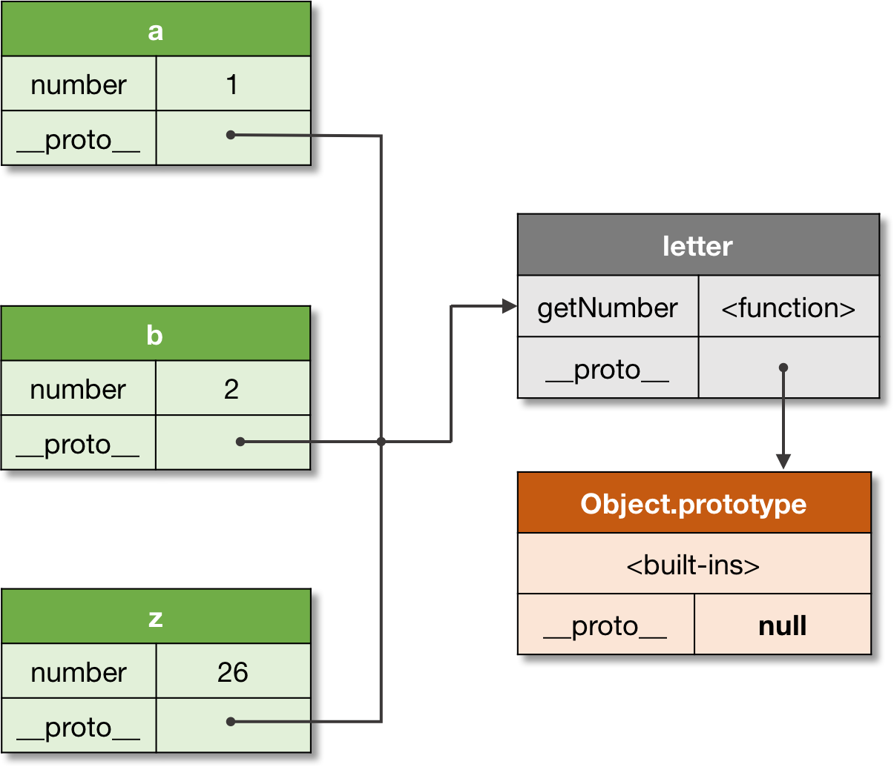
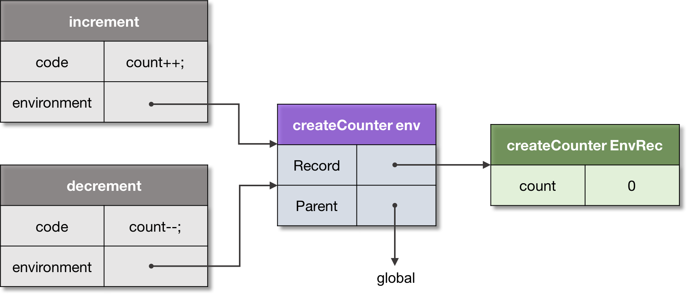

title: Javscript.The Core：2nd Edition
date: 2017/12/4
categories:
- javscript
---
这是'javascript核心'概览第二版，文章内容主要是ECMAScript程序语言以及运行时系统核心部分.

面向阅读对象：专业开发者

1. [对象(Object)](#object)
2. [原型(Prototype)](#prototype)
3. [类(Class)](#class)
4. [执行上下文(Execution context)](#executionContext)
5. [环境(Environment)](#environment)
6. [闭包(Closure)](#closure)
7. [This](#this)
8. [范围(Realm)](#realm)
9. [Job](#Job)
10. [代理(Agent)](#agent)

<!--more-->
第一版的文章主要覆盖了js语言以下这些方面，从es3中抽象的概念，以及一些在es5或es6中合适的改变。

自从es2015开始，这些核心的概念已经发生了改变并且引入了新的模块，在这一版的文章中我们将聚焦一些新概念和新技术，但是同时也会兼顾那些不同文档间保持不变的js基础结构。  

这篇文章将覆盖 ES2017+运行时系统

* 注意： 最新版的ECMAScript文档可以在TC-39网站找到

我们从讨论对象概念开始，它是整个ECMAScript的根基.

## <span id="object">Object</span>
ECMAScript 是一门基于原型的面向对象编程语言，对象是它的核心概念。

* Def.1 :对象：对象是属性的集合，且拥有一个原型对象，这个原型要么是个object要么是null值.

让我们创造一个基本的对象，对象的原型是通过一个内部属性[[Prototype]]引用,在用户层面这个属性同过\_\_proto\_\_来引用.  

看下面这段代码：

```
let point = {
    x: 10,
    y: 20
};
```

这个结构中有两个我们的显性属性很一个隐式属性\_\_proto\_\_,这个属性它指向point的原型:  


注意：对象也可以存储symbols,你可以从[这份文档](https://developer.mozilla.org/en-US/docs/Web/JavaScript/Reference/Global_Objects/Symbol)得到更多的信息.  

原型对象通常用于实现继承来动态分发,让我们来看看原型链细节.  


## <span id="prototype">原型(Prototype)</span>

每个对象在其创建的时候接受一个原型.如果这个原型没有显式设置,那么这个对象会接受一个默认原型当做它的继承对象.  

* Def.2:原型:prototype是一个委托对象，这个对象通常用于实现基于原型的继承.  

原型可以通过\_\_prot\_\_属性或者Object.create方法进行显式设置:  
```
// Base object.
let point = {
  x: 10,
  y: 20,
};
 
// Inherit from `point` object.
let point3D = {
  z: 30,
  __proto__: point,
};
 
console.log(
  point3D.x, // 10, inherited
  point3D.y, // 20, inherited
  point3D.z  // 30, own
);
```

注意： 默认的原型继承自Object.prototype.  

任何一个对象可以被当做另一个对象的原型,并且原型本身也可以有自己的原型.如果原型的原型指向一个非空(no-null)引用,以此类推，这样就形参了原型链.  

* Def.3: 原型链： 原型链是一个有限的对象链，这个对象链通常用于实现继承的属性共享.  


原型链的规则也是相当简单: 如果一个属性在对象上没有找到,那么就从它的原型上找,然后再原型的原型上找,以此类推直到原型链都被遍历为止.  

技术上来说这个机制通常以动态分发(dynamic dispatch)或者委托(delegation)而著称.  

Def.4: 委托：一个用来在继承链上找寻属性的机制,它通常发生在运行时,因此也被称作动态分发(dynamic dispatch)

* 注意：与动态分发在运行时求值相反的是,静态分发(static dispatch)在编译时确定引用值.  

如果属性在原型链上并没有找到，那么undefined将作为值返回.  

```
// An "empty" object.
let empty = {};
 
console.log(
 
  // function, from default prototype
  empty.toString,
   
  // undefined
  empty.x,
 
);
```
正如我所看到的，一个默认对象实际上永远都不是空的,它总是从Object.prototype继承一些东西.如果想继承一个空对象,我们可以显式的设置它的原型为null：   

```
// Doesn't inherit from anything.
let dict = Object.create(null);
 
console.log(dict.toString); // undefined
```

动态分发机制允许其修改原型链上委托对象:  

```
let protoA = {x: 10};
let protoB = {x: 20};

// Same as 'let objectC = {__proto__: protoA};'
let objectC = Object,create(protoA);
console.log(objectC.x); // 10

// change the delegate
Object.setPrototypeOf(objctC, protoB);
console.log(objectC.X); // 20
```

* 注意： 经过在今天\_\_proto\_\_属性已经标准化了,但是实践和举例中人们更加愿意使用如Object.create,Object.getPrototypeOf,Object.setPrototypeOf 这样的API方法来操作原型.  

在上面的例子中我们看到Obejct.prototyep,被不同的对象共享为原型,这是ECMAScript以基于类继承的实现方式.让我们在看看JS中的类的概念.  


## <span id="class">类(Class)</span>

当不同的对象拥有相同的初始状态和行为,这时它们共同的形成了一个类.  

* Def.5: 类： 类是一组拥有特定初始状态和行为的对象.  

当我们需要对多个对象继承自相同原型时,我们可以创建一个原型，然后显式的从这个创建的原型继承.  

```
// Generic prototype for all letters.
let letter = {
  getNumber() {
    return this.number;
  }
};
 
let a = {number: 1, __proto__: letter};
let b = {number: 2, __proto__: letter};
// ...
let z = {number: 26, __proto__: letter};
 
console.log(
  a.getNumber(), // 1
  b.getNumber(), // 2
  z.getNumber(), // 26
);
```

我们可以从下图中看他们之间的关系:  



然而这看起来相当笨重.并且类抽象刚好充当了句法糖的作用(i.e这个结构在语义上是相同的，但是是以一种更加词法化的形式),它让我们以一种方便的模式创建这样的对象.  

```
class Letter {
  constructor(number) {
    this.number = number;
  }
 
  getNumber() {
    return this.number;
  }
}
 
let a = new Letter(1);
let b = new Letter(2);
// ...
let z = new Letter(26);
 
console.log(
  a.getNumber(), // 1
  b.getNumber(), // 2
  z.getNumber(), // 26
);
```

* 注意：基于类的继承在ES中是通过原型委托来实现的.  

* 注意：类只是一种理论上的抽象.理论上来说它既可以通过静态分发来实现,如在java或者c++,也可以通过动态分发(委托)来实现,如javascript,Python,Ruby.等等.  

理论上类可以由"构造函数+原型"来表示.构造函数在创建对象的同时自动的将为新创建的实例设置原型.它的原型被存储在ConstructorFunction.prototype(构造函数的原型)上.  

* Def.6: 构造器: 构造器是一个用于创建实例并且自动为实例设置原型的函数.   

 可以显示的使用一个构造器函数，而且在类抽象被引进之前,JS开发者并没有更好的选择(我们可以在因特网上看到许多这样遗留代码):

 ```
 function Letter(number) {
  this.number = number;
}
 
Letter.prototype.getNumber = function() {
  return this.number;
};
 
let a = new Letter(1);
let b = new Letter(2);
// ...
let z = new Letter(26);
 
console.log(
  a.getNumber(), // 1
  b.getNumber(), // 2
  z.getNumber(), // 26
);
 ```
当创建一个单一层级的构造器是一件相当容易的事,从父类继承的模型需要更多的模板.当前这种模板的实现细节在我们创建JS类时已经被隐藏起来了.  

* 注意：构造器函数只是基于类继承的实现细节.  

让我们看一下对象和类的关系:  


这张图展示了每个对象都和一个原型相关联,甚至构造器函数(class)Letter也有自己的原型,这个函数的原型指向Function.prototype. 注意Letter.prototype是Letter实例的原型也就是a,b,z.  

* 注意:对于任何对象的实际原型都是指\_\_proto\_\_.同时在构造函数的显示属性prototype只是指向实例的原型的引用.其实实例的原型仍然是\_\_proto\_\_.可以从[这里](http://dmitrysoshnikov.com/ecmascript/chapter-7-2-oop-ecmascript-implementation/#explicit-codeprototypecode-and-implicit-codeprototypecode-properties)查看更多细节.  

你可以从[ES3. 7.1 OOP: The general theory](http://dmitrysoshnikov.com/ecmascript/chapter-7-1-oop-general-theory/)文章中找到更多关于一般面向对象编程(OPP)的概念(包括基于类,基于原型的描述,等等)  

现在我们对ECMAScript对象有了基本的了解,让我们再看一下JS的运行系统,我们将看到,在那儿任何东西都将以对象呈现.  


## <span id="executionContext">执行上下文(Execution context)</span> 

为了执行JS代码的同时跟踪代码运行时的求值,ECMAScript 规范定义了执行上下文的概念.逻辑上来说执行上下文坚持使用栈(stack:执行上下文栈我们将很快看到),它对应的更广为人知的概念为调用栈.  

* Def.7: 执行上下文：执行上下文是一个用于跟踪运行时对代码求值的东西  

在ESCMScript中有几种类型的代码：全局代码, 函数代码,eval代码,模块代码.每一种代码都是在执行上下文中求值.不同的代码，在一定类型对象下会影响执行上下文的结构：如generator function在上下文中保存它们的genarator对象时.  

让我们看一看下面的函数递归调用:  

```
function recursive(flag) {
 
  // Exit condition.
  if (flag === 2) {
    return;
  }
 
  // Call recursively.
  recursive(++flag);
}
 
// Go.
recursive(0);
```

一旦一个函数被调用时,一个新的执行上下文将被创建,同时将它推进栈中--这时就变成一个活动执行上下文(active execution context),当一个函数返回时,这个上下文就从栈中吐(poped)出来.  

一个上下文调用另一个上下文时，前一个上下文被称做调用者(caller),当一个上下文被调用对应的被称作被调用者(callee).在上面的例子中recursive函数扮演着两个角色：调用者和被调用者.  

* Def.8: 执行上下文栈：执行上下文栈是一个后进先出(LIFO)的结构,这种结构被用来控制执行顺序和流.  

对于上面的例子我们遵循栈的"push-pop"限制：  

 

我们可以看到,全局上下文总是栈底部,它在执行所有其他上下文前就已经创建.  

你可以在[合适的章节](http://dmitrysoshnikov.com/ecmascript/chapter-1-execution-contexts/)找到更多的细节.   

通常,上下文中代码将会运行完成，但是正如我所上面提到的--如generators也许会破坏后栈的进先出顺序.一个generator函数也许会暂停它的运行上下文,同时在它执行完之前将它从栈中移除.一旦generator被再次激活,它的上下文会再次回复并且将再次被推进栈中:  

```
function *gen() {
  yield 1;
  return 2;
}
 
let g = gen();
 
console.log(
  g.next().value, // 1
  g.next().value, // 2
);
```

这里的yield语句将对调用者返回value值,同时上下文将被吐出.当第二个next调用时,相同的上下文将被推进栈中恢复.这样上下文将会在创建它的调用者之外存活,因此它破坏了后进先出的结构.  

* 注意：你可以从这个[文档](https://developer.mozilla.org/en-US/docs/Web/JavaScript/Guide/Iterators_and_Generators)阅读更多关于generators和iterators的细节.  

我们将现在讨论一个执行上下文的重要组成部分,特别是ECMACript运行中在嵌套代码块中如何管理变量存储和作用域.一般它们被称做词法环境：它们在JS中用来存储数据以及解决"函数作为参数问题(Funarg problem)"--和闭包机制.  


## <span id="environment">环境(Environment)</span>

每个执行上下文都有一个与之相关联的词法环境.  

* Def.9: 词法环境： 词法环境是一个用于定义出现在上下文标识符和值之间关系.每个环境都一个指向可选父级环境的引用.  

所以一个环境就是存储在一个作用域定义的变量,函数,类.  

理论上来说,环境是由环境记录(一个实际上存储表,表的内容为标识符和值之间的映射),与可以指向父级环境(可能为null)的引用组成.  

代码如下:  

```
let x = 10;
let y = 20;
 
function foo(z) {
  let x = 100;
  return x + y + z;
}
 
foo(30); // 150
```

全局上下文和foo函数上下文的环境解构关系如下：  

  

这让我们想起先前提到原型链.并且标识符求值规则与之相当相似: 如果一个变量在当前环监局没有找到,那么就向父级环境寻找,然后父级的父级,以此类推,直到整个环境链被遍历完了.  

* Def.10:标识符求值：它是一个在环境链求值的过程,如果没有找到相应的绑定就会抛出一个ReferenceError错误.  

这就解释了为什么变量x求值为100,而不是10--它被在自己的环境foo中找到;为什么我们可以访问参数z--它也是时被存储在激活环境中;同时也能解释我们可以获取y的值--这是因为它在父级环境中可以找到.  

与原型相似的是,相同的父级环境可以被多个子级环境共享：如连个全局函数共享一个全局环境.  

* 注意：你可以从[这篇文章](http://dmitrysoshnikov.com/ecmascript/es5-chapter-3-2-lexical-environments-ecmascript-implementation/)得到关于词法环境实现的细节.  

环境记录根据类型被分为两种.一种是对象环境记录另一种是声明环境记录,在声明记录的上面也有函数环境记录，module环境记录.每一种记录都有对于自己属性的特征.但是对于标识符求值的一般机制它们是不分环境的,并且也不依赖记录的类型.  

下面是一个关于对象环境记录可以是全局环境.这个记录与一个绑定对象相关联.绑定对象可以从这个记录存储一些属性,但是不可以从其他地方,反之亦然.这个绑定对象可以从this值中获取.  

```
// Legacy variables using `var`.
var x = 10;
 
// Modern variables using `let`.
let y = 20;
 
// Both are added to the environment record:
console.log(
  x, // 10
  y, // 20
);
 
// But only `x` is added to the "binding object".
// The binding object of the global environment
// is the global object, and equals to `this`:
 
console.log(
  this.x, // 10
  this.y, // undefined!
);
 
// Binding object can store a name which is not
// added to the environment record, since it's
// not a valid identifier:
 
this['not valid ID'] = 30;
 
console.log(
  this['not valid ID'], // 30
);
```

上面代码可以描绘成下面图: 


注意：绑定对象的存在是为可以覆盖一些遗留的解构,如var声明,with语句，它们被当做绑定对象.当环境以简单对象来呈现是有历史原因的.当前的环境模型是优化过后的，但是作为结果是我们不能通过属性来访问这些绑定了.  

我们已经看到了环境如何通过父级连接相关联.现在我们来看一个环境怎样可以脱离创建它的上线文继续存活.这就就是我们将要讨论的闭包原理.  


## <span id="closure">闭包(Closure)</span> 

函数在ECMAScript中是第一公民.这是函数式编程的重要的根基概念.这就意味着函数式编程在js中得到部分的实现.  

* Def. 11: 第一公民函数:一个函数可以充当普通的数据:可以被存储为变量,传做参数,从另一个函数中当做值返回.  

第一公民函数的概念和被叫做"Funcarg problem"(函数作为参数的问题)相关.这个问题引起函数如何处理自由变量.  

* Def.12 : 自由变量：一个既不是当前函数参数也不是当前函数本地变量的变量.  

让我们看看"Funcarg problem",然后看ECMAScript是如何解决的.  

看如下代码: 

```
let x = 10;
 
function foo() {
  console.log(x);
}
 
function bar(funArg) {
  let x = 20;
  funArg(); // 10, not 20!
}
 
// Pass `foo` as an argument to `bar`.
bar(foo);
```

变量x对于函数foo是自由变量. 当foo函数调用时(通过函数参数传递)--x的值是那里绑定的?是函数创建的地方,或者是调用者作用域,也就是函数调用的地方?正如我们所见x的值为20.  

上面用例描述了广为人知的"下放函数参数问题(downward funarg problem)",i.e 一个关于如何决定环境绑定的问题：是应该绑定创建时的环境,或者是调用时的环境.  

它被一个一个使用静态作用域的共识解决了,也就是创建时的作用域.  

Def.13:静态作用域:一个实现静态作用域的语言,是通过其源码位置决定环境绑定.  

静态作用也叫词法环境,因此以词法环境命名.  

* 注意：你可以通过[这篇文章](https://codeburst.io/js-scope-static-dynamic-and-runtime-augmented-5abfee6223fe)了解静态和动态作用域.  

在我们的例子中,foo函数捕获的环境就是全局环境.  


Def. 14: closure: 闭包就是函数对定义时环境的捕获,这个环境通常用来对标识符的求值.  

对于函数参数的另一种问题被称为"上升函数参数问题(upward funarg problem)".它们唯一不同的是捕获环境在脱离创建环境时任然存活.  

让我们看下这个例子：  

```
function foo() {
  let x = 10;
   
  // Closure, capturing environment of `foo`.
  function bar() {
    return x;
  }
 
  // Upward funarg.
  return bar;
}
 
let x = 20;
 
// Call to `foo` returns `bar` closure.
let bar = foo();
 
bar(); // 10, not 20!
```

理论上它的捕获环境机制并没有变.只是在这种情况下,我们没闭包了吗?foo的激活环境将被销毁.但是我们捕获了它,所以它被保存起来--来支持静态作用域语义.  

这里常常存在对闭包不完整的理解. --通常开发者认为的闭包只是"上升函数参数问题".但是,正如我们可以看到,理论上来说上升和下钻参数问题都是一样的--静态作用域机制.  

如上所述,和原型相似的是--相同的父环境可以被多个闭包所共享,这让我们获取和改变共享数据:

```
function createCounter() {
  let count = 0;
 
  return {
    increment() { count++; return count; },
    decrement() { count--; return count; },
  };
}
 
let counter = createCounter();
 
console.log(
  counter.increment(), // 1
  counter.decrement(), // 0
  counter.increment(), // 1
);
```

因为两个闭包，increment和decrement都在同一个包含变量count的环境创建,所以它们共享同一个父级作用域,总是通过引用--意味着引用对全部的父级环境保持存储.

  

一些语言也许只是捕获值,也就是制作一份捕获变量的副本,并且不允许其对父级作用域的改变.但是在js中,总是父级作用域总是通过引用.

注意：在实现上也许会对这个步骤进行优化.并且不会捕获整个环境.只会捕获'自由变量',但是它们仍会保持对父级作用域数据改变的能力.  

你可以从[合适的文章](http://dmitrysoshnikov.com/ecmascript/chapter-6-closures/)找到闭包和函数参数问题相关细节.  

可以说所有的标识符都是静态绑定的.但是在ECMAScript中任然有一个是动态绑定的值this. 


## <span id="this">this</span>

 this的值是一个动态的并且是隐式传入代码上下文的.我们可以将它当做一个隐式额外参数，它可以被访问但是不能被改变.  

 this值的目的在于相同代码给多个对象使用.  

 * Def. 15: This: 一个用于访问执行上下文的隐式上下文对象--它的目的在于让相同代码可以被多个对象使用.  

 它的主要用例为基于类的面向对象编程(OOP).一个存于实例上的方法(定义在原型上),实际上要被所有基于这个类的实例使用.  

 ```
 class Point {
  constructor(x, y) {
    this._x = x;
    this._y = y;
  }
 
  getX() {
    return this._x;
  }
 
  getY() {
    return this._y;
  }
}
 
let p1 = new Point(1, 2);
let p2 = new Point(3, 4);
 
// Can access `getX`, and `getY` from
// both instances (they are passed as `this`).
 
console.log(
  p1.getX(), // 1
  p2.getX(), // 3
);
 ```

 当开始激活getX方法时,一个用于创建本地变量和参数的环境被创建.此外，一个[[ThisValue]]被传递到函数环境记录,这个值动态的绑定函数调用者.当调用者为p1时,this的值就是p1,第二种情况就是p2.  

 this的另一应用,是通用接口函数的混合与覆盖.

在下面例子中,Movable包含一个通用接口函数move,这个函数期望使用者对_x和_y的混合(mixin).  

```
// Generic Movable interface (mixin).
let Movable = {
 
  /**
   * This function is generic, and works with any
   * object, which provides `_x`, and `_y` properties,
   * regardless of the class of this object.
   */
  move(x, y) {
    this._x = x;
    this._y = y;
  },
};
 
let p1 = new Point(1, 2);
 
// Make `p1` movable.
Object.assign(p1, Movable);
 
// Can access `move` method.
p1.move(100, 200);
 
console.log(p1.getX()); // 100
```

另一方面.混合也可以应用于原型级别而不只是实例.  

为了展示this值的动态属性,看下面的这个例子.我们将留给读者当做一个练习解决:  

```
function foo() {
  return this;
}
 
let bar = {
  foo,
 
  baz() {
    return this;
  },
};
 
// `foo`
console.log(
  foo(),       // global or undefined
 
  bar.foo(),   // bar
  (bar.foo)(), // bar
 
  (bar.foo = bar.foo)(), // global
);
 
// `bar.baz`
console.log(bar.baz()); // bar
 
let savedBaz = bar.baz;
console.log(savedBaz()); // global
```

因为只是看foo函数的源码是无法区分this的值的.所以我们说this值动态的.  

* 你可以在相应的[章节](http://dmitrysoshnikov.com/ecmascript/chapter-3-this/)找到答案.  

在箭头函数里this的值很特殊:this值是词法的(静态的),而不是动态的.I.e.它们函数环境记录不提供this的值,而且它们是从父级环境获取.  

```
var x = 10;
 
let foo = {
  x: 20,
 
  // Dynamic `this`.
  bar() {
    return this.x;
  },
 
  // Lexical `this`.
  baz: () => this.x,
 
  qux() {
    // Lexical this within the invocation.
    let arrow = () => this.x;
 
    return arrow();
  },
};
 
console.log(
  foo.bar(), // 20, from `foo`
  foo.baz(), // 10, from global
  foo.qux(), // 20, from `foo` and arrow
);
```

正如我们所说,在全局上下文中this的值是全局对象(它绑定着全局环境记录的对象),先前全局对象只有一个.但是现在版本的规范里也许有多个全局对象.这些全局对象只针对部分代码范围.让我们看看这种结构.  


## <span id="realm">范围</span>

在求值之前,所有的ECMAScript代码都和一个范围相关联.理论上范围只是为一个上下文提供一个全局环境.  

当一个执行上下文被创建时它就和一个特别代码范围相关联.这个代码范围只是为这个上下文提供一个全局环境.这个关联是不可变的.  

* 注意： 在浏览器环境中一个最直接的返回为iframe,她恰好体同一个全局环境,在Node.js中最接近的是沙箱的[vm module](https://nodejs.org/api/vm.html)   

当前版本的规范并没有提供一个realms创建的具体方法,但是它们可以由实现环境隐式实现. 这里有一个关于暴露给用户使用API的[提议](https://github.com/tc39/proposal-realms/)  

理论上每个在栈中上下文都和自己的范围相关联.  


现在我们对运行时ECMAScript的大地图更靠近了. 但是我们任然需要看一看入口代码和初始化过程.它们都由一个叫jobs和job序列的机制管理.  


## <span id="job">job</span>

一些操作可以被推迟,并且只有在执行上下文栈有空的时候就可以执行.  

* Def.17:Job:job是一种抽象的操作,它在当前进程中没有其他ECMAScript计算时发起一个ECMAScript计算.  

jobs在job序列中排序,在当前规范版本中有两种job序列:ScriptJobs,和PromiseJobs.  

在ScriptJobs上的初始化job是我们程序的主入口--就是对我们的初始化脚本加载和求值：范围(realm)创建，全局上下文与范围相关联,推入调用栈，全局代码执行.  

* 注意，ScriptJobs序列同时管理脚本和modules.  

接着这个上下文可以执行其他上下文，或者其他排队的jobs. 

当么有运行的执行上下文同时执行上下文栈为空时，ECMAScript将在job系列的第一个等待job移除,同时创建一个执行上下开始执行这个job.  

* 注意：job序列通常被称为"event loop"的管理.ECMAScript标准并没有明确规定这个"event loop",它的实现都留给了实现环境了.但是你可以发现一个启发式的例子在这儿.  

```
// Enqueue a new promise on the PromiseJobs queue.
new Promise(resolve => setTimeout(() => resolve(10), 0))
  .then(value => console.log(value));
 
// This log is executed earlier, since it's still a
// running context, and job cannot start executing first
console.log(20);
 
// Output: 20, 10
```

async 函数可以对promise进行await,所以它们也是排队序列: 

```
async function later() {
  return await Promise.resolve(10);
}
 
(async () => {
  let data = await later();
  console.log(data); // 10
})();
 
// Also happens earlier, since async execution
// is queued on the PromiseJobs queue.
console.log(20);
```

现在我们相当接近JS的全貌了,现在我们将看这些组件的主要拥有者,代理.  


## <span id="agent">代理(agent)</span>

在ECMAScript中并发和并行是通过代理模式实现. 代理模式与[演员模式](https://en.wikipedia.org/wiki/Actor_model)相当接近--一种轻量的处理消息传递方式的过程.  

* Def.18: Agent: 代理是一种对执行上下文栈,一系列job队列,代码范围的抽象.  

实现者依赖代理究竟是可以允许在单一线程,还是多线程.如在浏览器环境中worker agent就是代理概念的例子.  

代理们的状态是相互独立的,它们可以通过发送消息来沟通.一些数据可以在不同代理之间共享,如sharedArrayBuffer.代理们可以组成集群.  

所以下面是ECMAScript运行时的全貌:  


这就是发生在ECMAScript引擎下全图.  

现在我们来到了文章结尾处.这是篇文章有很多关于js核心的信息.如我们提到的JS代码可以将它分为modules，对象属性通过proxy跟踪等等分类--这儿有很多用户级别的细节你可以从不同文档读到.  

但是这里我们尽力展现ECMAScript程序本身的逻辑结构,同时希望澄清它们一些的细节.如果你有任何问题,建议或者反馈--我将很乐意在评论中讨论.  


